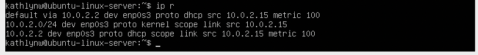
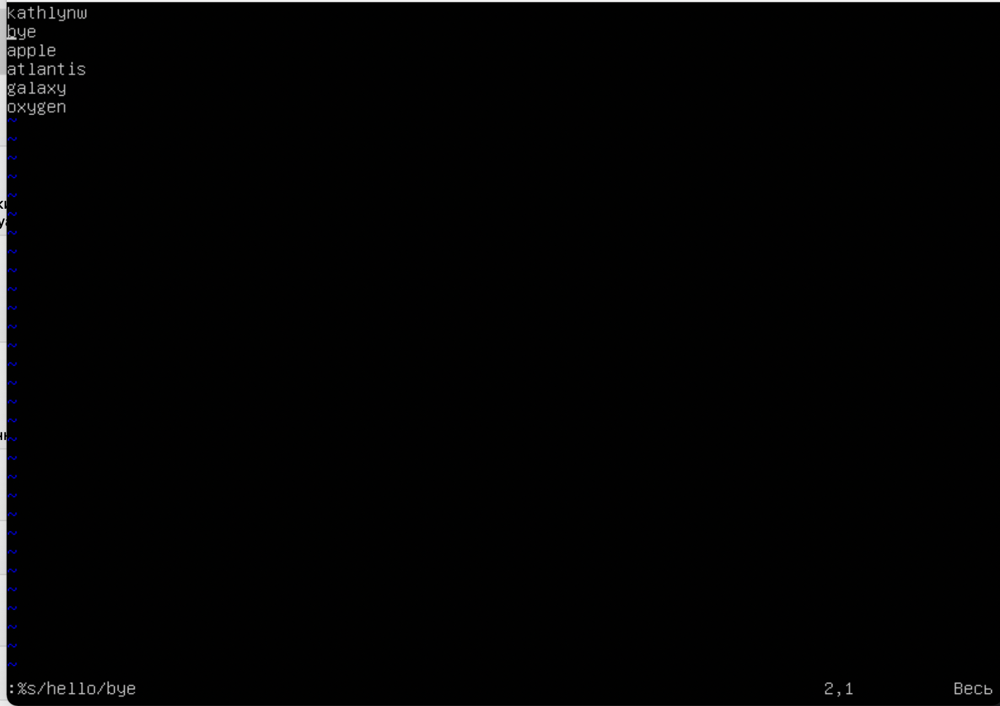

# D01_Linux-1 - REPORT

# **Part 1. Installation of the OS**

Установлена версия OS: Ubuntu 20.04 Server LTS without GUI

Использованная команда: **cat /etc/issue**

# Part 2. Creating a user

Добавление пользователя осуществляется командой: **sudo adduser name**

При этом создание пользователя с использованием “**sudo**” дает ему права администратора 

Результат команды **cat /etc/passwd** - указание в выводе имени нового пользователя:

# **Part 3. Setting up the OS network**

 **Задать название машины вида user-1**

 **Установить временную зону, соответствующую вашему текущему местоположению**

Использованная команда - **timedatectl**

 **Вывести названия сетевых интерфейсов с помощью консольной команды**

Использованная команда - **ip link show**  - позволяет увидеть информацию обо всех доступных устройствах

**Loopback** (lo) — совокупность методов, нужных для корректной работы маршрутизатора и передачи данных. Сам интерфейс же является отображением логических процессов в маршрутизаторе.

 **Используя консольную команду получить ip адрес устройства, на котором вы работаете, от DHCP сервера**

Использованная команда - **ip r**

**DHCP** — протокол прикладного уровня модели TCP/IP, служит для назначения IP-адреса клиенту. Это следует из его названия — Dynamic Host Configuration Protocol. IP-адрес можно назначать вручную каждому клиенту, то есть компьютеру в локальной сети. Но в больших сетях это очень трудозатратно, к тому же, чем больше локальная сеть, тем выше возрастает вероятность ошибки при настройке. Поэтому для автоматизации назначения IP был создан протокол DHCP.

 **Определить и вывести на экран внешний ip-адрес шлюза (ip) и внутренний IP-адрес шлюза, он же ip-адрес по умолчанию (gw)**

Использованная команда - **ip addr show** - позволяет вывести внутренний IP-адрес шлюза

Для определения внешнего IP-адреса его необходимо спарсить с вебсайта, для этого использован сайт [ifconfig.me](http://ifconfig.me) и команда: **wget -q -O - ifconfig.me/ip**

 **Задать статичные (заданные вручную, а не полученные от DHCP сервера) настройки ip, gw, dns (использовать публичный DNS серверы, например 1.1.1.1 или 8.8.8.8)**

Для открытия интерфейса используем команду: sudo nano /etc/network/interfaces

В открывшемся редакторе вводим новые данные

 **Перезагрузить виртуальную машину с помощью команды: sudo reboot и пропинговать удаленные хосты 1.1.1.1 и [ya.ru](http://ya.ru/) и вставить в отчёт скрин с выводом команды**

# **Part 4. OS Update**

**Обновить системные пакеты до последней на момент выполнения задания версии**

Использовать команды $ apt-get update and $ sudo apt-get upgrade OS update

# **Part 5. Using the sudo command**

Команда **sudo** может использоваться для выполнения пользователем какой-либо команды, требующей права суперпользователя (root), то есть получение прав root для выполнения какой-либо команды на время её выполнения.

- Переключение на user-2 и наделение ему прав sudo

# **Part 6. Installing and configuring the time service**

Настройка службы автоматической синхронизации времени

# **Part 7. Installing and using text editors**

• Редактор **VIM** 

Для выхода с сохранением изменений: ESC, :wq, ENTER

• Редактор **nano**

Для выхода с сохранением изменений: control + x, y

• Редактор **JOE**

Для выхода с сохранением изменений: control + k, q, y

• Редактор **VIM** 

Для выхода без сохранения изменений: ESC, :q!, ENTER

• Редактор **nano**

Для выхода без сохранения изменений: control + x, n

• Редактор **JOE**

Для выхода без сохранения: control + k, q, n

• Поиск в **vim**: “/” искомое и :q! для выхода без изменения

• Замена в **vim**: “:%s/слово_для_замены/на_что_меняем” и :q! для выхода без изменения

• Поиск в **nano**: Control + W

• Замена в **nano**:  Control + \ и строка для замены и enter y для подтверждения замены. 
Ctrl + X + N для выхода без сохранения

• Поиск в **JOE**: Control + G

• Замена в **JOE**: Control + G + R + строка для замены

# **Part 8. Installing and basic setup of the SSHD service**

 **Установка службы SSHd**

 **Создание файла: $ sudo nano /etc/ssh/sshd_config**

 **Используя команду ps, показать наличие процесса sshd**

**ps aux:**

• **ps** - команда для вывода информации о запущенных процессах. В простейшей форме, когда используется без какой-либо опции, ps будет напечатано четыре столбца информации для минимум двух процессов, запущенных в текущей оболочке, самой оболочки и процессов, которые выполняются в оболочке при выполнении команды.

• **a** - указывает ps вывести на дисплей процессы всех пользователей, за исключением тех процессов, которые не связаны с терминалом и процессами группы лидеров

• **u** - подставки для ориентированных на пользователя форматов, которые обеспечивают подробную информацию о процессах

• **x** - перечисляет процессы без управляющего терминала. В основном это процессы, которые запускаются во время загрузки и работают в фоновом режиме

 **Перезапустить систему: $ sudo reboot**
    
    
    

Команда **netstat**, входящая в стандартный набор сетевых инструментов UNIX, отображает различную network–related информацию, такую как сетевые подключения, статистику интерфейсов, таблицы маршрутизации, masquerade, multicast, и т.п.

- t — отображает только TCP-соединения
- a — отображает все активные соединения и порты TCP и UDP, которые прослушивает компьютер
- n — отображает активные TCP-соединения, однако адреса и номера портов выражаются в цифрах, и попытки определить имена не предпринимаются

**Proto** — протокол соединения.

**Recv-Q** — данные, которые еще не были извлечены приложением из буфера сокета. Высокий уровень Recv-Q означает, что данные помещаются в буфер приема TCP/IP, но приложение не вызывает функцию Recv() для копирования их из буфера TCP/IP в буфер приложения.

**Send-Q** — данные, которые передающее приложение передало транспортному средству, но еще не подтверждено принимающим TCP. Высокий уровень Send-Q означает, что данные помещаются в буфер отправки TCP/IP, но не отправляются или отправляются, но не подтверждаются. Таким образом, высокое значение Send-Q может быть связано с перегрузкой сети сервера, проблемой производительности сервера или контролем потока пакетов данных.

**Local Address** – IP-адрес локального компьютера и номер используемого порта.

**Foreign Address** — IP-адрес и номер порта удаленного компьютера, к которому подключен сокет.

**State** – указывает состояние TCP-соединения. Возможные состояния: CLOSE_WAIT, CLOSED, ESTABLISHED, FIN_WAIT_1, FIN_WAIT_2, LAST_ACK, LISTEN, SYN_RECEIVED, SYN_SEND и TIME_WAIT.

**0.0.0.0** — клиентские устройства, такие как ПК, отображают адрес 0.0.0.0, когда они не подключены к какой-либо сети TCP/IP. Устройство может получить этот адрес по умолчанию, если оно не в сети. В случае сбоя при назначении адреса он может быть назначен автоматически DHCP. На тот случай, если на вашем устройстве установлен этот адрес, оно не сможет общаться с другими устройствами в сети через IP.

# **Part 9. Installing and using the top, htop utilities**

 **Установить и запустить утилиты top и htop**

Команда для установки: **sudo apt-get install htop (или top)**

 **Определение вывода команды top**
    
    
    
- uptime - 3:33
- количество авторизованных пользователей - 1 user
- общая загрузка системы - 0,00, 0,00, 0,00
- общее количество процессов: 95 total, 1 running, 94 sleeping, 0 stopped, 0 zombie
- загрузка cpu: 0,0 us, 0,3 sy, 0,0 ni, 99,7 id, 0,0 wa, 0,0 hi, 0,0 si, 0,0 st
- загрузка памяти - MiB Mem
- pid процесса, занимающего больше всего памяти - 1
- pid процесса, занимающего больше всего процессорного времени - 3821

 **Определение вывода команды htop**
- отсортированный по PID

- PERCENT_CPU
    
    
    
- PERCENT_MEM

- TIME
    
    
    
- отфильтрованный для процесса sshd
    
    
    
- с процессом syslog, найденным, используя поиск
    
    
    
- с добавленным выводом hostname, clock и uptime
    
    
    

# **Part 10. Using the fdisk utility**

### Команда fdisk -l

Команда fdisk **позволяет задействовать одноименную утилиту для модификации таблиц разделов жестких дисков формата MSDOS**. Для модификации таблиц разделов жестких дисков формата GPT используется утилита gdisk:

• **-l, --list** - вывести все разделы на выбранных устройствах или если устройств не задано, то на всех устройствах;

• **l** - вывести список известных типов разделов.

- Название жесткого диска, его размер, количество секторов
    
    
    

**Сектор** — это минимальная единица хранения данных на диске, обычно его размер составляет 512 байт. Все сектора на диске нумеруются: каждый из n секторов получает номер от 0 до n–1. Благодаря этому любая информация, записанная на диск, получает точный адрес — номера соответствующих секторов.

- Размер SWAP
    
    
    
    **SWAP** – один из механизмов виртуальной памяти, при котором отдельные фрагменты памяти (обычно неактивные) перемещаются из ОЗУ во вторичное хранилище (отдельный раздел или файл), освобождая ОЗУ для загрузки других активных фрагментов памяти.
    

# **Part 11. Using the df utility**

**$ df /root:**

- размер раздела - 8408452
- размер занятого пространства - 3028276
- размер свободного пространства - 4931460
- процент использования - 39%

Единица измерения блока — 1024 байта

**$ df -Th:**

- размер раздела - 8.1 G
- размер занятого пространства - 2.9 G
- размер свободного пространства - 4.8 G
- процент использования - 39%
    
    
    
    # **Part 12. Using the du utility**
    
    **$ du**
    
    Команда du позволяет задействовать одноименную утилиту, предназначенную для вывода информации об объеме дискового пространства, занятого файлами и директориями
    
    **• Вывести размер папки /home (в байтах, в человекочитаемом виде):**
    
   
    
    **• Вывести размер папки /var (в байтах, в человекочитаемом виде):**
    
    
    
    **• Вывести размер папки /var/log (в байтах, в человекочитаемом виде):**
    
    
    
    **• $ sudo du /var/log -a | less:**
    
    
    
    **• $ sudo du /var/log -ah | less:**
    
    
    
    
    
    # **Part 13. Installing and using the ncdu utility**
    
    - **Установить утилиту ncdu**
    - **Вывести размер папки /home**:
        
        
        
    - **Вывести размер папки /var:**
        
        
        
    - **Вывести размер папки /var/log:**
        
        
        
    
    # **Part 14. Working with system logs**
    
    **/var/log/dmesg** – драйвера устройств. Одноименной командой можно просмотреть вывод содержимого файла. Размер журнала ограничен, когда файл достигнет своего предела, старые сообщения будут перезаписаны более новыми. Задав ключ 
    `--level=` можно отфильтровать вывод по критерию значимости.
    
    **var/log/syslog** — содержит глобальный системный журнал, в котором пишутся сообщения с момента запуска системы, от ядра Linux, различных служб, обнаруженных устройствах, сетевых интерфейсов и много другого.
    
    **var/log/auth.log** — информация об авторизации пользователей, включая удачные и неудачные попытки входа в систему, а также задействованные механизмы аутентификации.
    
    Используем команду **cat /var/log/auth.log:**
    
    
    
    **Время последнего успешного входа в систему** — **06.09, 18:36:09**
    
    **Имя пользователя**  — **kathlynw**
    
    **Метод входа** — **pam_unix**
    
    **Перезапуск службы SSHd**
    
    
    
    # **Part 15. Using the CRON job scheduler**
    
    **Cron** — это планировщик задач, используемый для выполнения задач (в фоновом режиме) в указанное время.
    
    Crontab - команда, которая используется, для управления планировщиком Cron. Команда crontab создает файл crontab, содержащий команды и инструкции для запуска демона cron.
    
     Используя планировщик заданий, запустить команду uptime через каждые 2 минуты:
    
    Использовать команду $ crontab -e и выбрать текстовый редактор. В открывшемся файле ввести: */2 * * * * uptime и сохранить изменения:
    
    
    
    Вывод на экран списка текущих заданий для CRON:
    
    **$ crontab -l**
    
    
    
    Команда uptime запускается каждые две минуты:
    
    **$ grep -i cron /var/log/syslog**
    
    
    
     Удалить все задания из планировщика заданий
    
    $ crontab -r - удалите все задания; 
    
    $ crontab -l - показать все задания.
    
    Перечень текущих заданий CRON:
    
    