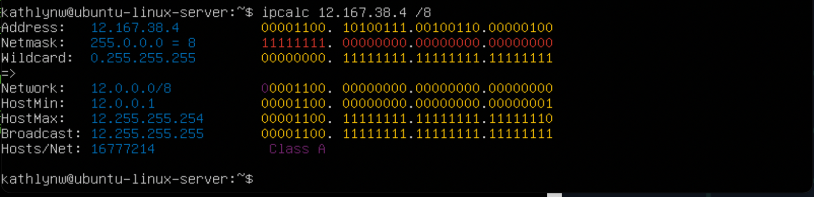
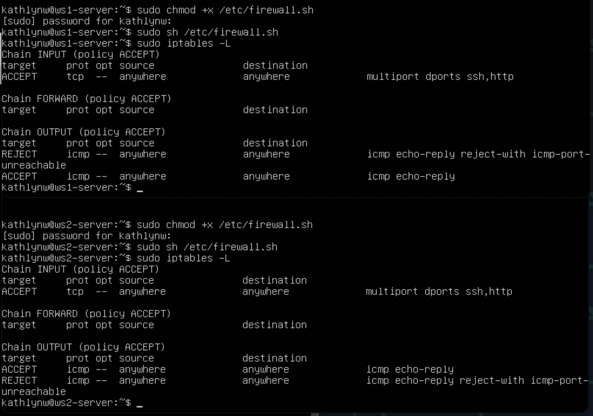
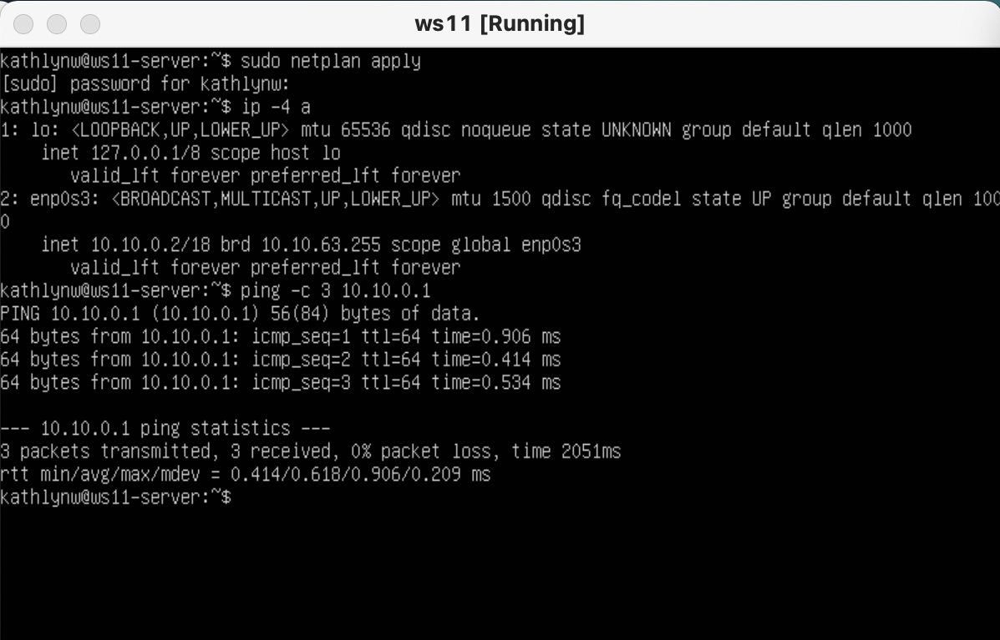
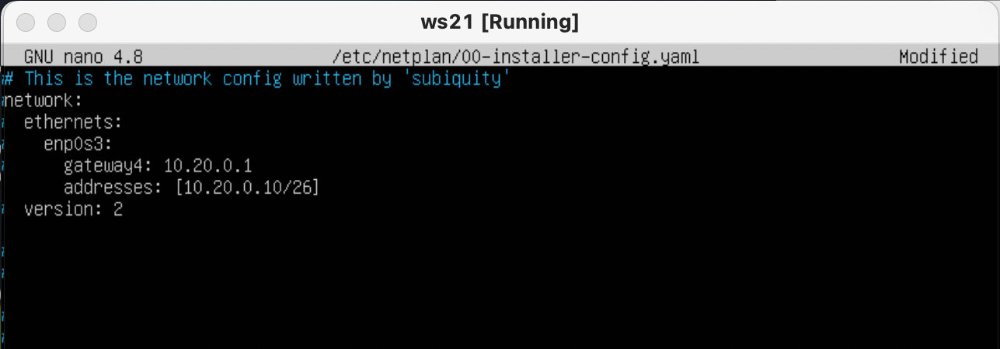
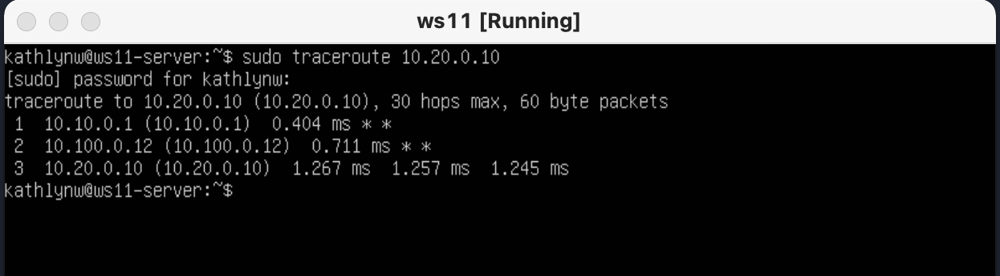
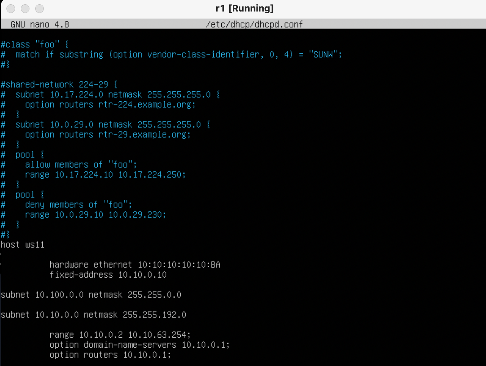

# DO2_LinuxNetwork-1 - REPORT

Настройка сетей в Linux на виртуальных машинах.

## Contents

1. Инструмент ipcalc
2. Статическая маршрутизация между двумя машинами
3. Утилита iperf3
4. Сетевой экран
5. Статическая маршрутизация сети
6. Динамическая настройка IP с помощью DHCP
7. NAT
8. Допополнительно. Знакомство с SSH Tunnels

## Part 1. Инструмент **ipcalc**

Работа с виртуальной машиной ws1.

### 1.1. Сети и маски

### Определить и записать в отчёт:

### 1) адрес сети *192.167.38.54/13*

**ipcalc** предоставляет простой метод для вычисления IP-информации хоста. Различные опции определяют, какую информацию **ipcalc** должен вывести на стандартный выход. Могут быть заданы несколько опций. Обрабатываемый IP-адрес всегда должен быть указан. Для большинства операций также требуется сетевая маска или префикс CIDR.

Воспользовавшись командой `ipcalc`, можно определить адрес сети в поле Address


> Сетевой адрес — идентификатор устройства, работающего в компьютерной сети.
> 

### 2) перевод маски *255.255.255.0* в префиксную и двоичную запись, */15* в обычную и двоичную, *11111111.11111111.11111111.11110000* в обычную и префиксную

> Маска подсети — битовая маска для определения по IP-адресу адреса подсети и адреса узла этой подсети. В отличие от IP-адреса маска подсети не является частью IP-пакета. Благодаря маске можно узнать, какая часть IP-адреса узла сети относится к адресу сети, а какая — к адресу самого узла в этой сети.
> 

> Префиксная запись. Краткий формат записи маски подсети, в котором указывается только количество единичных битов в маске после косой черты.
> 
- Префиксная запись маски *255.255.255.0* в поле Network: `/24`
- Двоичная запись маски *255.255.255.0* в поле Netmask: `11111111.11111111.11111111.00000000`


- */15* в обычной записи в поле Netmask: `255.254.0.0`
- */15* в двоичной записи также в поле Netmask: `1111111.11111110.00000000.00000000`


> Команда `ipcalc` не принимает маски в двоичной записи, поэтому переведем исходную маcку *11111111.11111111.11111111.11110000* в обычную запись и получим *255.255.255.240*
> 
- В обычной форме: `255.255.255.240`
- В префиксной форме: `/28`


### 3) минимальный и максимальный хост в сети *12.167.38.4* при масках: */8*, *11111111.11111111.00000000.00000000*, *255.255.254.0* и */4*

- минимальный и максимальный хосты в сети *12.167.38.4* при масках:
    - */8*
        - Минимальный хост сети: `12.0.0.1`
        - Максимальный хост сети: `12.255.255.254`



- *11111111.11111111.00000000.00000000*
    - Минимальный хост сети: `12.167.0.1`
    - Максимальный хост сети: `12.167.255.254`


- *255.255.254.0*
    - Минимальный хост сети: `12.167.38.1`
    - Максимальный хост сети: `12.167.39.254o`


### 1.2. localhost

### Определить и записать в отчёт, можно ли обратиться к приложению, работающему на localhost, со следующими IP: *194.34.23.100*, *127.0.0.2*, *127.1.0.1*, *128.0.0.1*

> Обратная петля loopback позволяет компьютеру связываться с самим собой, используя протоколы сетевых подключений.
> 
- IP: *194.34.23.100*


- IP: *127.0.0.2*


- IP: *127.1.0.1*


- IP: *128.0.0.1*


Можно ли обратиться к приложению, работающему на localhost, со следующими IP:

- 194.34.23.100 - нет
- 127.0.0.2 - да
- 127.1.0.1 - да
- 128.0.0.1 - нет

### 1.3. Диапазоны и сегменты сетей

### 1) какие из перечисленных IP можно использовать в качестве публичного, а какие только в качестве частных: *10.0.0.45*, *134.43.0.2*, *192.168.4.2*, *172.20.250.4*, *172.0.2.1*, *192.172.0.1*, *172.68.0.2*, *172.16.255.255*, *10.10.10.10*, *192.169.168.1*

> Все IP-адреса протокола IPv4 делятся на публичные/глобальные/внешние (их называют "белые") — они используются в сети Интернет, и частные/локальные/внутренние (их называют "серые") — используются в локальной сети.
> 
- Публичные IP:


> К частным "серым" адресам относятся IP-адреса из следующих подсетей: От 10.0.0.0 до 10.255.255.255 с маской 255.0.0.0 или /8 От 172.16.0.0 до 172.31.255.255 с маской 255.240.0.0 или /12 От 192.168.0.0 до 192.168.255.255 с маской 255.255.0.0 или /16 От 100.64.0.0 до 100.127.255.255 с маской подсети 255.192.0.0 или /10
> 

> Это зарезервированные IP-адреса. Такие адреса предназначены для применения в закрытых локальных сетях, распределение таких адресов никем не контролируется.
> 
- Частные IP:


### 2) какие из перечисленных IP адресов шлюза возможны у сети *10.10.0.0/18*: *10.0.0.1*, *10.10.0.2*, *10.10.10.10*, *10.10.100.1*, *10.10.1.255*


> Диапазон возможных IP-адресов: 10.0.0.1 - 10.10.63.254
> 
- Возможные адреса: 10.0.0.1, 10.10.0.2
- Невозможные адреса: 10.10.10.10, 10.10.100.1, 10.10.1.255

## Part 2. Статическая маршрутизация между двумя машинами

Работа с виртуальными машинами ws1 и ws2.

### С помощью команды `ip a` посмотреть существующие сетевые интерфейсы


### Описать сетевой интерфейс, соответствующий внутренней сети, на обеих машинах и задать следующие адреса и маски: ws1 - *192.168.100.10*, маска */16*, ws2 - *172.24.116.8*, маска */12*

- Содержимое файла *etc/netplan/00-installer-config.yaml* для ws1 и для ws2


### Выполнить команду `netplan apply` для перезапуска сервиса сети


Сетевые интерфейсы после выполнения команды:


### 2.1. Добавление статического маршрута вручную

### Добавить статический маршрут от одной машины до другой и обратно при помощи команды вида `ip r add`ip r add

- ws1:


- ws2:


### Пропинговать соединение между машинами

> Ping — утилита для проверки целостности и качества соединений в сетях на основе TCP/IP.
> 


### 2.2. Добавление статического маршрута с сохранением

### Перезапустить машины

- Перезапустим машины с помощью `sudo reboot`
- Проверим, что после перезапуска статические маршруты были удалены


### Добавить статический маршрут от одной машины до другой с помощью файла *etc/netplan/00-installer-config.yaml*

- Добавим статические маршруты с помощью файла *etc/netplan/00-installer-config.yaml*


- Проверим, что изменения в файле сохранены, и применим новую конфигурацию с помощью `sudo netplan apply`


- C помощью `ip r` убедимся, что маршруты добавлены


### Пропинговать соединение между машинами

- Пропингуем соединение между машинами


## Part 3. Утилита **iperf3**

*В данном задании используются виртуальные машины ws1 и ws2 из Части 2*

### 3.1. Скорость соединения

### Перевести и записать в отчёт: 8 Mbps в MB/s, 100 MB/s в Kbps, 1 Gbps в Mbps

- Перевод

| Исходное | Перевод | Пояснение |
| --- | --- | --- |
| 8 Mbps | 1 MB/s | 1 MB = 8 Mb |
| 100 MB/s | 800000 Kbps | 1 MB = 8 * 10^3 Kb |
| 1 Gbps | 1000 Mbps | 1 Gb = 10^3 Mb |

### 3.2. Утилита **iperf3**

Утилита iperf3 **позволяет измерить максимальную пропускную способность между двумя узлами сети**. Может использовать различные параметры тайминга, протоколов, потоков и т. п. Это кроссплатформенная клиент-серверная программа.

### Измерить скорость соединения между ws1 и ws2

- Сначала необходимо запустить серверную часть программы. Для этого выполним на ws1 `iperf3 -s`. Таким образом, был запущен сервер с адресом `192.168.100.10`


- Подключимся к серверу с помощью `iperf3 -c 192.168.100.10` и получим информацию о скорости подключения


- Скорость передачи для sender (ws1): 3.45 Gbps
- Скорость передачи receiver (ws2): 3.44 Gbps

## Part 4. Сетевой экран

> Сетевой экран – это своего рода управляемый барьер или шлюз, который контролирует разрешенную и запрещенную веб-активность в частной сети.
> 

### 4.1. Утилита **iptables**

### Создать файл */etc/firewall.sh*, имитирующий фаерволл, на ws1 и ws2:

```
#!/bin/sh

# Удаление всех правил в таблице "filter" (по-умолчанию).
iptables –F
iptables -X
```

### Нужно добавить в файл подряд следующие правила:

### 1) на ws1 применить стратегию когда в начале пишется запрещающее правило, а в конце пишется разрешающее правило (это касается пунктов 4 и 5)

### 2) на ws2 применить стратегию когда в начале пишется разрешающее правило, а в конце пишется запрещающее правило (это касается пунктов 4 и 5)

### 3) открыть на машинах доступ для порта 22 (ssh) и порта 80 (http)

### 4) запретить *echo reply* (машина не должна "пинговаться”, т.е. должна быть блокировка на OUTPUT)

### 5) разрешить *echo reply* (машина должна "пинговаться")

- Создадим файл `/etc/firewall.sh` и применим правила:


> Здесь:
> 
> - A - добавить новое правило в цепочку
> - p - протокол tcp
> - ACCEPT - разрешить
> - REJECT - запретить

### Запустить файлы на обеих машинах командами `chmod +x /etc/firewall.sh` и `/etc/firewall.sh`

- Запустим файлы на обеих машинах командами `sudo chmod +x /etc/firewall.sh` и `sudo sh /etc/firewall.sh`
- С помощью `iptables -L` рассмотрим, как выполняется просмотр правил



- Опишем разницу между стратегиями, применёнными в первом и втором файлах

> В файлах /etc/firewall.sh был использован флаг -j - выбрать действие, если правило подошло.
> 
> 
> Таким образом, при обработке правил сверху-вниз при совпадении описанных условий применяется то правило, что расположено выше.
> 
> Из-за того, что в файле ws1 запрещающее правило находится выше разрешающего, виртуальная машина 1 не может пропинговать виртуальную машину 2.
> 
> Для виртуальной машины 2 ситуация противоположная, поскольку разрешающее правило выше запрещающего.
> 

### 4.2. Утилита **nmap**

### Командой **ping** найти машину, которая не "пингуется", после чего утилитой **nmap** показать, что хост машины запущен

*Проверка: в выводе nmap должно быть сказано: `Host is up`*

- пингуем ws2 с ws 1 - пинг проходит


- пингуем ws1 c ws2 - и видим, что пинг не проходит и сразу проводим проверку утилитой nmap


> ``````````````````Вижу сообщение *Host is up*`
> 

## Part 5. Статическая маршрутизация сети

Сеть:


### Поднять пять виртуальных машин (3 рабочие станции (ws11, ws21, ws22) и 2 роутера (r1, r2))


### 5.1. Настройка адресов машин

### Настройка адресов машин

- В настройках Virtualbox меняем типы соединения:
    - ws11, ws21, ws21:
        
        Адаптер 1 - NAT
        
        Адаптер 2 - Внутренняя сеть
        
    - r1, r2:
        
        Адаптер1 - NAT
        
        Адаптер 2 - Внутренняя сеть
        
        Адаптер 3 - Внутренняя сеть
        
- Благодаря этому у машин появятся новые интерфейсы, которые можно настроить в соответствии со схемой.
    
    ### Настроить конфигурации машин в etc/netplan/00-installer-config.yaml согласно сети на рисунке.
    

- ws11


- r1


- ws21


- ws22


- r2


### Перезапустить сервис сети. Если ошибок нет, то командой ip -4 a проверить, что адрес машины задан верно. Также пропинговать ws22 с ws21. Аналогично пропинговать r1 с ws11.

- ws11 и пинг r1



- r1


- ws21


- ws22


- r2


### 5.2. Включение переадресации IP-адресов.

### Для включения переадресации IP, выполните команду на роутерах:

`sysctl -w net.ipv4.ip_forward=1`

- ввод на r1


- ввод на r2


### Откройте файл /etc/sysctl.conf и добавьте в него следующую строку:

`net.ipv4.ip_forward = 1`

- изменяю файл для r1 и r2


### 5.3. Установка маршрута по-умолчанию

### Настроить маршрут по-умолчанию (шлюз) для рабочих станций. Для этого добавить default перед IP роутера в файле конфигураций

- добавляю шлюз для ws11

[text](images/57.png)

- для ws21



- для ws22


- также потребовалось добавить шлюзы для роутеров, чтобы пинг доходил в соседнюю сеть
- r1


- и r2


### Вызвать ip r и показать, что добавился маршрут в таблицу маршрутизации

- ws11


- ws21


- ws22


- роутеры r1


- и r2


### Пропинговать с ws11 роутер r2 и показать на r2, что пинг доходит. Для этого использовать команду:

`tcpdump -tn -i eth1`

- tcpdump — это **утилита командной строки, которую вы можете использовать для захвата и проверки сетевого трафика, идущего в вашу систему и из нее**. Это наиболее часто используемый сетевыми администраторами инструмент для устранения неполадок в сети и тестирования безопасности.

Изменяю eth1 на название моего адаптера enp0s3 и пингую:

- ws11


- r2sud


### 5.4. Добавление статических маршрутов

### Добавить в роутеры r1 и r2 статические маршруты в файле конфигураций. Пример для r1 маршрута в сетку 10.20.0.0/26:

```
# Добавить в конец описания сетевого интерфейса eth1:
- to: 10.20.0.0
  via: 10.100.0.12

```

- добавленные маршруты для роутеров r1


- и r2


### Вызвать ip r и показать таблицы с маршрутами на обоих роутерах.

- r1


- r2


### Запустить команды на ws11:

`ip r list 10.10.0.0/[маска сети]` и `ip r list 0.0.0.0/0`

- команда `ip r list 10.10.0.0/[маска сети]`


- команда `ip r list 0.0.0.0/0`


- Маршрут по умолчанию имеет более низкий приоритет и срабатывает, когда не найден подходящий маршрут в таблице маршрутизации. Для сети 10.10.0.0 мы создали правило, соответственно используется созданный маршрут. Также можно устанавливать метрику, чтобы менять приоритеты маршрутов.

### 5.5. Построение списка маршрутизаторов

### Запустить на r1 команду дампа:

`tcpdump -tnv -i eth0`

### При помощи утилиты traceroute построить список маршрутизаторов на пути от ws11 до ws21

- Устанавливаем утилиту traceroute: `sudo apt install traceroute`.
- Устанавливаем статические маршруты для наших виртуалок:
- ws11


- ws21


- ws22


- r1


- r2


- вызов и вывод traceroute на ws11



- вызов и вывод tcpdump -tnv -i enp0s3 на r1


- Принцип построения пути при помощи traceroute:
    
    Для определения промежуточных маршрутизаторов traceroute отправляет серию пакетов данных целевому узлу, при этом каждый раз увеличивая на 1 значение поля TTL («время жизни»). Это поле обычно указывает максимальное количество маршрутизаторов, которое может быть пройдено пакетом. Первый пакет отправляется с TTL, равным 1, и поэтому первый же маршрутизатор возвращает обратно сообщение ICMP, указывающее на невозможность доставки данных. Traceroute фиксирует адрес маршрутизатора, а также время между отправкой пакета и получением ответа (эти сведения выводятся на монитор компьютера). Затем traceroute повторяет отправку пакета, но уже с TTL, равным 2, что позволяет первому маршрутизатору пропустить пакет дальше.
    
    Процесс повторяется до тех пор, пока при определённом значении TTL пакет не достигнет целевого узла. При получении ответа от этого узла процесс трассировки считается завершённым.
    

### 5.6. Использование протокола ICMP при маршрутизации

### Запустить на r1 перехват сетевого трафика, проходящего через eth0 с помощью команды:

`tcpdump -n -i eth0 icmp`

### Пропинговать с ws11 несуществующий IP (например, 10.30.0.111) с помощью команды:

`ping -c 1 10.30.0.111`

- tcpdump на r1


- ping на ws11


## Part 6. Динамическая настройка IP с помощью DHCP

### Для r2 настроить в файле /etc/dhcp/dhcpd.conf конфигурацию службы DHCP:

- для начала скачиваю isc-dhcp-server: `sudo apt install isc-dhcp-server`

### 1) указать адрес маршрутизатора по-умолчанию, DNS-сервер и адрес внутренней сети.

- вношу изменения в файл /etc/dhcp/dhcpd.conf


### 2) в файле resolv.conf прописать nameserver 8.8.8.8.

- вношу изменения в файл /etc/resolv.conf


### Перезагрузить службу DHCP командой systemctl restart isc-dhcp-server. Машину ws21 перезагрузить при помощи reboot и через ip a показать, что она получила адрес. Также пропинговать ws22 с ws21.

- перезагружаю службу DHCP


- Перезагружаю ws21 с помощью команды `sudo reboot` и вызываю команду `ip a`


ip адрес получен

- пингую ws22 с ws21


### Указать MAC адрес у ws11, для этого в etc/netplan/00-installer-config.yaml надо добавить строки: macaddress: 10:10:10:10:10:BA, dhcp4: true

- вношу изменения в /etc/netplan/00-installer-config.yaml


### Для r1 настроить аналогично r2, но сделать выдачу адресов с жесткой привязкой к MAC-адресу (ws11). Провести аналогичные тесты

- Снова скачиваю isc-dhcp-server и вношу изменения в файл /etc/dhcp/dhcpd.conf



- затем редактирую файл /etc/resolv.conf


- перезагружаю службу DHCP


- перезагружаю ws11 и вызываю `ip a`


- пингую ws22


### Запросить с ws21 обновление ip адреса

- `ip a` на ws21 до обновления


- вызываю команду `sudo dhclient enp0s3 -r`, потом `sudo dhclient enp0s3` и снова `ip a`


- в данном пункте пользовалась опцией -r для того, чтобы очистить список ip адресов.

## Part 7. NAT

### В файле /etc/apache2/ports.conf на ws22 и r1 изменить строку Listen 80 на Listen 0.0.0.0:80, то есть сделать сервер Apache2 общедоступным

- ws22


- r1


### Запустить веб-сервер Apache командой `service apache2 start` на ws22 и r1

- ws22


- r1


### Добавить в фаервол, созданный по аналогии с фаерволом из Части 4, на r2 следующие правила:

1. Удаление правил в таблице filter - iptables -F
2. Удаление правил в таблице "NAT" - iptables -F -t nat
3. Отбрасывать все маршрутизируемые пакеты - iptables --policy FORWARD DROP


### Запускать файл также, как в Части 4


### Проверить соединение между ws22 и r1 командой ping


### Добавить в файл ещё одно правило:

1. Разрешить маршрутизацию всех пакетов протокола ICMP


### Запускать файл также, как в Части 4


### Проверить соединение между ws22 и r1 командой ping


### Добавить в файл ещё два правила:

1. Включить SNAT, а именно маскирование всех локальных ip из локальной сети, находящейся за r2 (по обозначениям из Части 5 - сеть 10.20.0.0)
2. Включить DNAT на 8080 порт машины r2 и добавить к веб-серверу Apache, запущенному на ws22, доступ извне сети


### Запускать файл также, как в Части 4


### Проверить соединение по TCP для SNAT, для этого подключиться к серверу Apache на r1 командой:

`telnet [адрес] [порт]`


## Part 8. Дополнительно. Знакомство с SSH Tunnels

### Запустить на r2 фаервол с правилами из Части 7

- смотрю правила фаервола


- Запускаю его


### Запустить веб-сервер Apache на ws22 только на localhost (то есть в файле */etc/apache2/ports.conf* изменить строку `Listen 80` на `Listen localhost:80`)

- вношу изменения в файл


- Запускаю веб-сервер


### Воспользоваться Local TCP forwarding с ws21 до ws22, чтобы получить доступ к веб-серверу на ws22 с ws21

- Использую команду `ssh -L [local_port]:localhost:[local_port] [remote_ip]`


### Воспользоваться Remote TCP forwarding c ws11 до ws22, чтобы получить доступ к веб-серверу на ws22 с ws11

- Использую команду `ssh -R [remote_port]:localhost:[local_port] [remote_ip]`


Результат:

