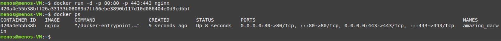
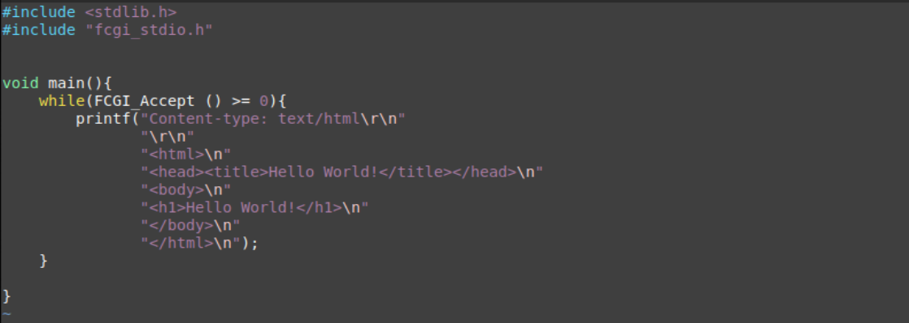
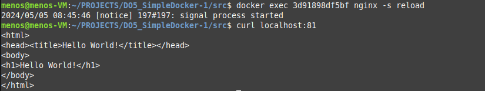

# Simple Docker

## PART 1. Готовый докер

Возьмем официальный докер-образ с nginx и выкачаем его при помощи docker pull.


Проверяем наличие докер-образа через docker images.


Запускаем докер-образ через docker run -d [image_id|repository].


Проверяем, что образ запустился через docker ps.


Посмотрим информацию о контейнере через docker inspect [container_id|container_name].
По выводу команды определи и помести в отчёт размер контейнера, список замапленных портов и ip контейнера.
- Размер контейнера:            1,09 кБ (виртуально 188 мб) 
- Список замаппленых портов:    отсутствуют
- IP-контейнера:                172.17.0.2    

Остановим докер образ через docker stop [container_id|container_name] и проверим, что образ остановился через docker ps.


Запустим докер с портами 80 и 443 в контейнере, замапленными на такие же порты на локальной машине, через команду run.


Проверь, что в браузере по адресу localhost:80 доступна стартовая страница nginx.


Перезапусти докер контейнер через docker restart [container_id|container_name]


## PART 2.  Операции с контейнером

Прочитай конфигурационный файл nginx.conf внутри докер контейнера через команду exec.


Создай на локальной машине файл nginx.conf.


Настраиваем в нем по пути /status отдачу страницы статуса сервера nginx.


Скопируй созданный файл nginx.conf внутрь докер-образа через команду docker cp.


Перезапусти nginx внутри докер-образа через команду exec.


Проверь, что по адресу localhost:80/status отдается страничка со статусом сервера nginx.


Экспортируй контейнер в файл container.tar через команду export.


Останови контейнер.


Удали образ через docker rmi [image_id|repository], не удаляя перед этим контейнеры.


Удали остановленный контейнер.


Импортируй контейнер обратно через команду import.


Запусти импортированный контейнер.


Проверь, что по адресу localhost:80/status отдается страничка со статусом сервера nginx.


## PART 3. Мини веб-сервер

Написали мини-сервер на C и FastCgi, который будет возвращать простейшую страничку с надписью Hello World!.


Потребуется установить также `libfcgi-dev` и `spawn-fcgi`
Компиляция производится с флагами: 
    - `-l` используется для указания компилятору, что нужно связать программу с библиотекой.
	- `fcgi` имя библиотеки.

Запустим написанный мини-сервер через spawn-fcgi на порту 8080.


Напиши свой nginx.conf, который будет проксировать все запросы с 81 порта на 127.0.0.1:8080.


Проверь, что в браузере по localhost:81 отдается написанная тобой страничка.


Проверим, что все корректно работает из контейнера:




Положим файл nginx.conf по пути ./nginx/nginx.conf (это понадобится позже).


## PART 4. Свой докер

Написали свой докер-образ, который:

1) собирает исходники мини сервера на FastCgi из Части 3;

2) запускает его на 8080 порту;

3) копирует внутрь образа написанный ./nginx/nginx.conf;

4) запускает nginx.
Воспользовался готовым образом с nginx'ом, как базовым.


Собрали написанный докер-образ через docker build при этом указав имя и тег.


Проверили через docker images, что все собралось корректно.


Запустили собранный докер-образ с маппингом 81 порта на 80 на локальной машине и маппингом папки ./nginx внутрь контейнера по адресу, где лежат конфигурационные файлы nginx'а.


Проверь, что по localhost:80 доступна страничка написанного мини сервера.


Допиши в ./nginx/nginx.conf проксирование странички /status, по которой надо отдавать статус сервера nginx.

Перезапусти докер-образ.
Если всё сделано верно, то, после сохранения файла и перезапуска контейнера, конфигурационный файл внутри докер-образа должен обновиться самостоятельно без лишних действий
Проверь, что теперь по localhost:80/status отдается страничка со статусом nginx


## PART 5. Dockle
Прежде всего установим Dockle при помощи команды:
`VERSION=$(
 curl --silent "https://api.github.com/repos/goodwithtech/dockle/releases/latest" | \
 grep '"tag_name":' | \
 sed -E 's/.*"v([^"]+)".*/\1/' \
) && curl -L -o dockle.deb https://github.com/goodwithtech/dockle/releases/download/v${VERSION}/dockle_${VERSION}_Linux-64bit.deb
sudo dpkg -i dockle.deb && rm dockle.deb`

Просканируем образ из предыдущего задания через dockle [image_id|repository].


Исправим образ так, чтобы при проверке через dockle не было ошибок и предупреждений.
- CIS-DI-0010  - свидетельствует о том, что не нужно хранить какие-либо "секреты" в докерфайле
- DKL-DI-0005  - предупреждение говорит о том, что должны очистить кэши apt-get после установки пакетов
- CIS-DI-0001  - предупреждение говорит о том, что должны создать пользователя для контейнера и не использовать пользователя root. 
- DKL-DI-0006  - предупреждение говорит о том, что должны избегать использования тега latest при выборе базового образа Docker. 
- CIS-DI-0005  - предупреждение говорит о том, что вы должны включить доверие к содержимому для Docker.
- CIS-DI-0006  - то предупреждение говорит о том, что должны добавить инструкцию HEALTHCHECK в ваш Dockerfile. Это позволяет Docker проверять, работает ли приложение корректно
- CIS-DI-0008  - предупреждение указывает на то, что в Docker образе могут быть файлы с установленными разрешениями setuid или setgid

После всех исправлений результат такой:


Запускаем так:

```zsh
docker build -t mini_server:0.1 .
docker images | grep -ie 'mini_server'

export DOCKER_CONTENT_TRUST=1
dockle mini_server:0.1

docker run -p 80:81 mini_server:0.1
docker ps
```

## PART 6. Базовый Docker Compose


- Напишем файл `docker-compose.yml`, с помощью которого:<br>
  1) Поднимем докер-контейнер из Части 5.
  2) Поднимем докер-контейнер с nginx, который будет проксировать все запросы с 8080 порта на 81 порт первого контейнера.

```yaml
version: '3'
services:
  mini_server:
    image: mini_server:0.1
    networks:
      - mynetwork

  nginx:
    image: nginx:latest
    volumes:
      - ./nginx.conf:/etc/nginx/nginx.conf:ro
    ports:
      - 80:8080
    networks:
      - mynetwork
    depends_on:
      - mini_server

networks:
  mynetwork:
    driver: bridge
```

Меняем nginx.conf:


Сборка и запуск проекта

```zsh
docker stop $(docker ps -q)

docker-compose build
docker-compose up -d
```


